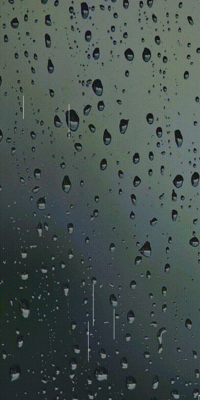

# react-native-rain
Simple rain animation for React Native

### Import Rain to use it
- Pass it a prop of numDrops to determine density of rain droplets.
- Droplets render from well above the screen then transition down to just below the visible range.
- Too many droplets causes dropped frames. More than about 100 often causes this.
  
#### Example

